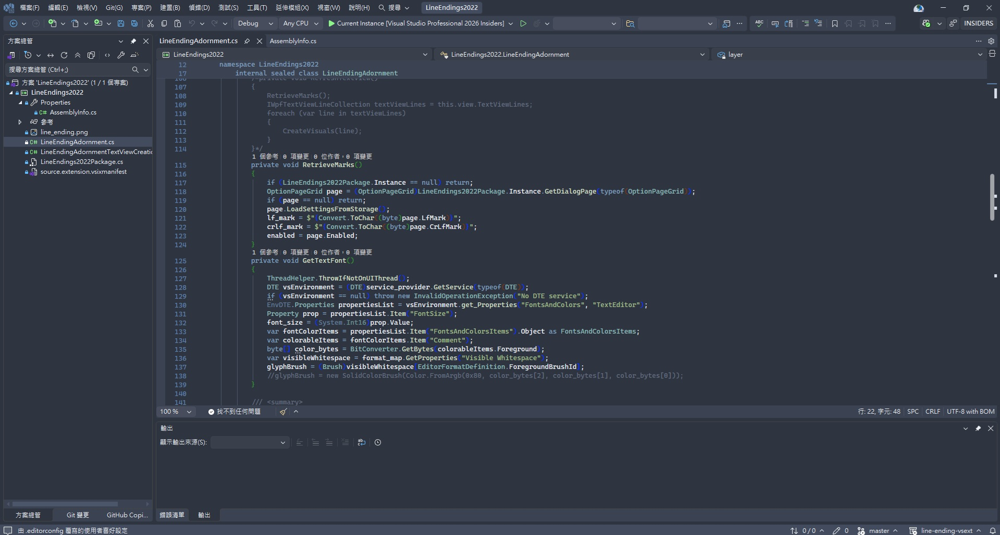

# Nord Fluent Theme

Nordic theme mainly for Visual Studio 2026

### Version 1.0
There are still some colors not suitable.

### Ver. 1.0.5
Change some colors of Cpp code elements.

### Ver. 1.0.6
Change some background colors.

## Reference
These colors are introduced from https://github.com/dst80/nordic

Custom theme settings are modified from https://github.com/dst80/nordic and https://github.com/austinstanding/midnight-lights-vstheme , thanks.